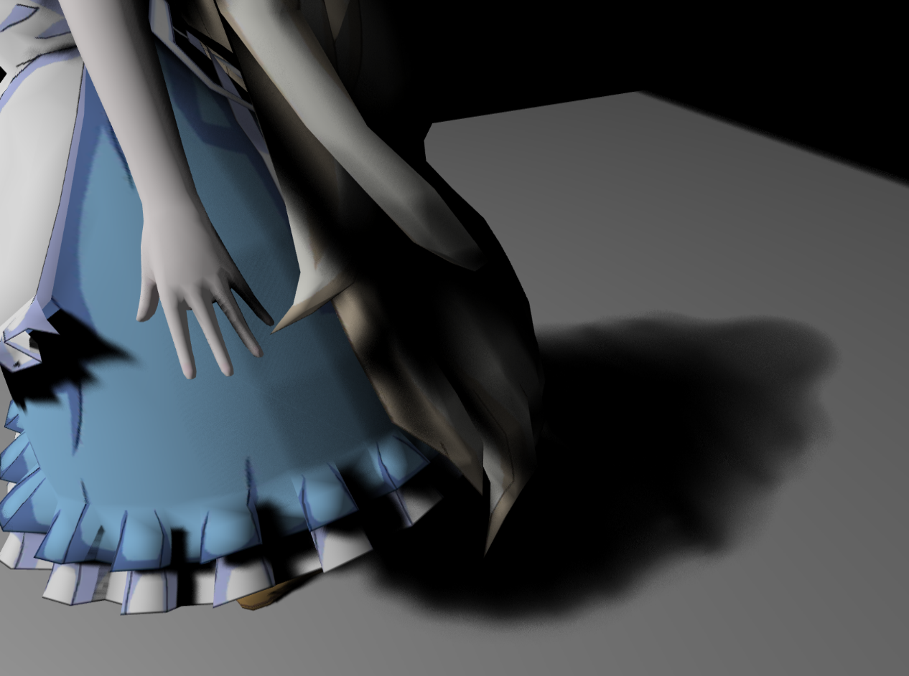
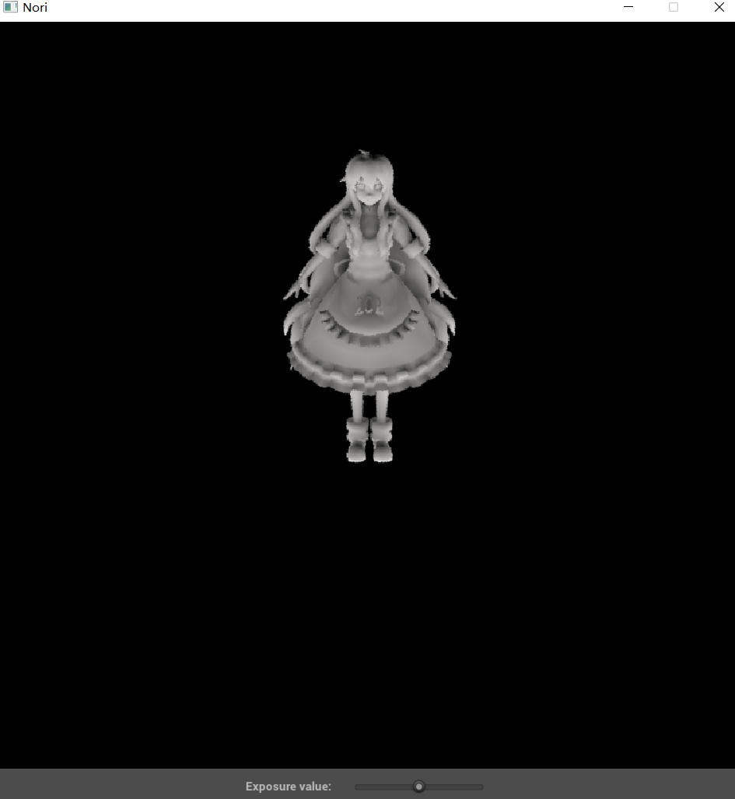
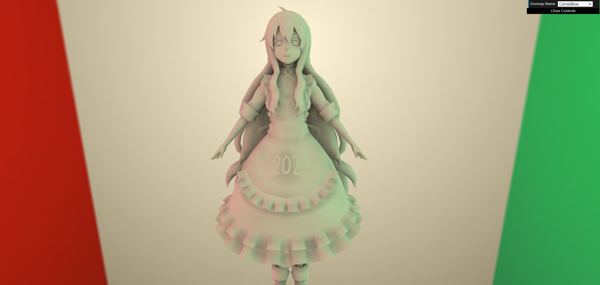

# GAMES202
Course assignments for GAMES202

作业的初始源代码可以在[GAMES论坛](https://games-cn.org/forums/topic/games202zuoyehuizong/)中找到

# Assignment 0 (a0) 环境配置

操作系统：Windows 11

IDE：vscode

# Assignment 1 (a1) 实时阴影

## shadow map

## PCF

**Naive PCE**

**PoissonSample PCF**

采样20点，noise比较大

## PCSS

远处更虚

# Assignment 2 (a2) Precomputed Radiance Transfer

## PRT

**环境光**

